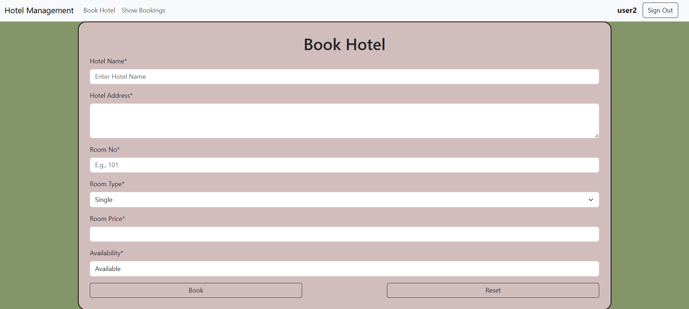
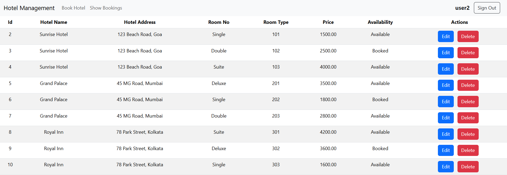
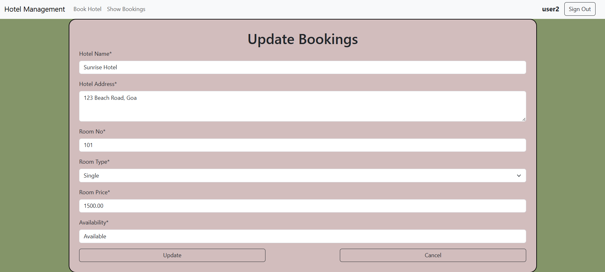
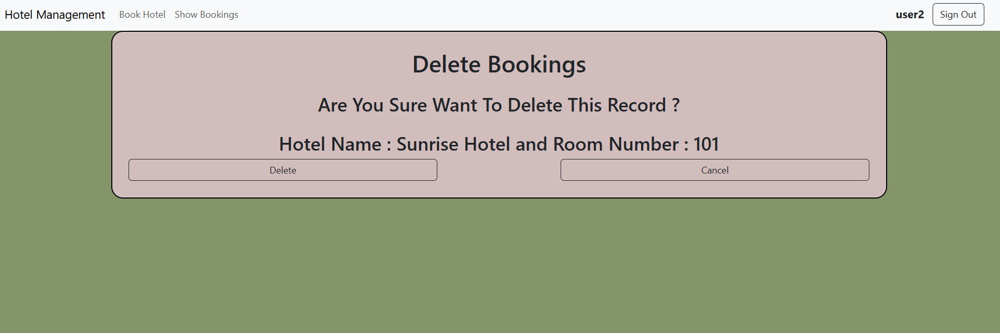

# 🏨 Hotel Management System

A Django-based Hotel Management System featuring CRUD operations for hotel rooms.  
Includes Bootstrap-styled forms, dropdowns for room types, and automatic timestamps for record creation and updates.  
Uses **MySQL** as the database backend.

---

## ✨ Features
- Add new hotel rooms with details (name, address, room number, type, price, availability).
- View all rooms in a clean Bootstrap-styled table.
- Edit room details (update price, type, availability).
- Delete rooms with confirmation.
- Dropdown list for room types (Single, Double, Suite, Deluxe).
- Auto-generated timestamps (`date_added`, `date_updated`).
- MySQL database integration.

---

## 🛠️ Tech Stack
- **Backend:** Django 5.x, Python 3.x  
- **Frontend:** Bootstrap 5  
- **Database:** MySQL  
- **Other:** HTML templates, Django forms  

---

## ⚙️ Installation

1. **Clone the repo**
   ```bash
   git clone https://github.com/omkarpawar2002/Hotel_Management_System.git
   cd Hotel_Management_System
   ```

2. **Create a virtual environment**
   ```
    python -m venv venv
    venv\Scripts\activate
   ```

3. **Install dependencies**
   ```
   pip install -r requirements.txt
   ```

4. **Run migrations**
   ```
   python manage.py makemigrations
   python manage.py migrate
   ```

5. **Start The Server**
   ```
   python manage.py runserver
   ```

## 📂 Project Structure
```
    Hotel_Management_System/
    │
    ├── hotel/                  # Django project folder
    ├── management/             # App folder (models, views, forms, templates)
    │   ├── templates/
    │   │   └── management/
    │   │       ├── base.html
    │   │       ├── room_list.html
    │   │       ├── room_form.html
    │   │       └── room_confirm_delete.html
    │   ├── static/
    │   │   └── css/style.css
    │   ├── models.py
    │   ├── forms.py
    │   ├── views.py
    │   └── urls.py
    ├── requirements.txt
    ├── manage.py
    └── README.md
```

---

## 📸 Screenshots

### 🔑 Sign Up Page


### 🔐 Sign In Page


### ➕ Add Room Form


### 📋 Room List


### ✏️ Edit Room


### ❌ Delete Confirmation


---

## 🔖 GitHub Topics
`django` · `python` · `crud` · `hotel-management` · `bootstrap` · `mysql`

---

## 👨‍💻 Author

**Omkar Pawar**  
- GitHub: [@omkarpawar2002](https://github.com/omkarpawar2002)  

---

